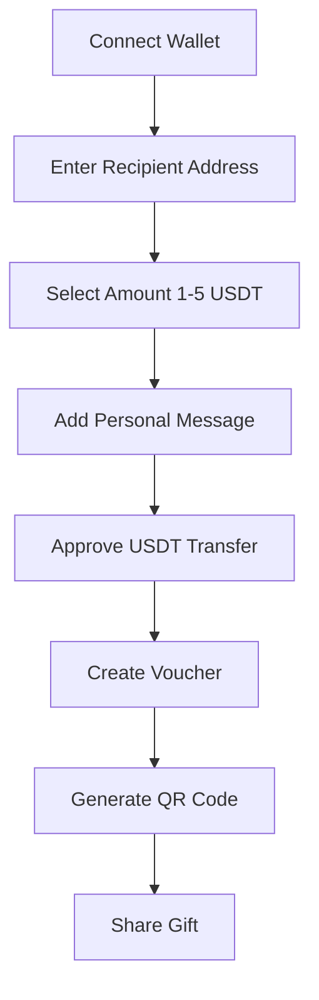
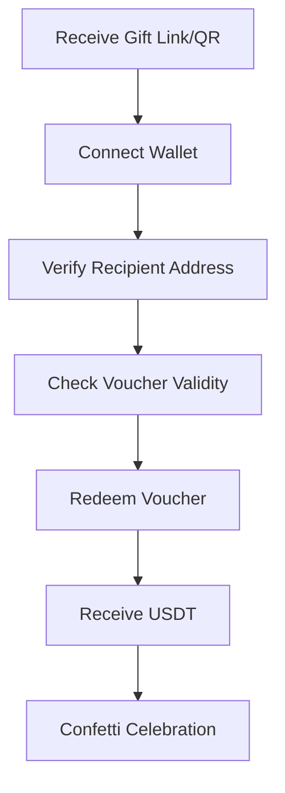
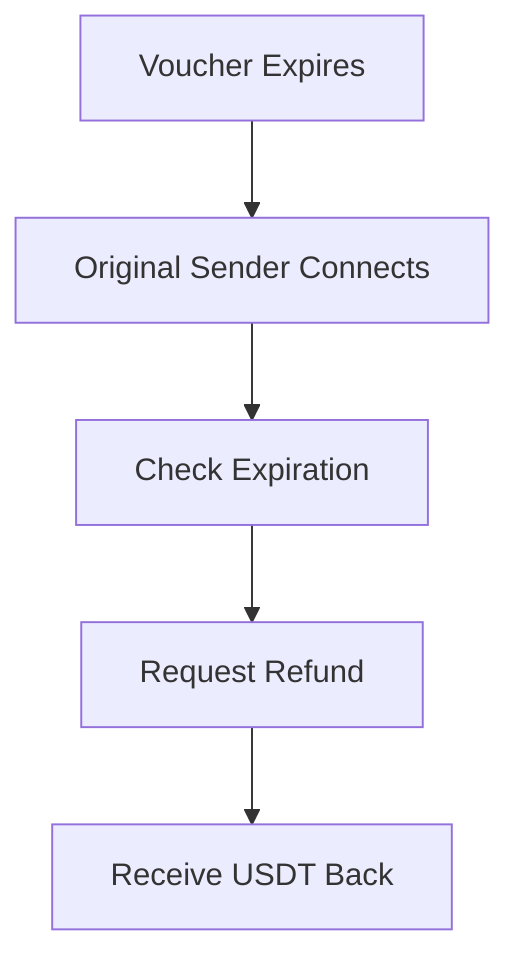

# 🎁 Morph Gift

> Send surprise crypto gifts that bring smiles across the digital world

Morph Gift is a decentralized gift-giving platform built on blockchain technology that allows users to send USDT-based gift vouchers to anyone, anywhere in the world. The platform combines the joy of gift-giving with the security and transparency of blockchain technology.

## Features

### Core Functionalities

- **Single Gift Creation**: Send individual gift vouchers with personalized messages
- **Batch Gift Creation**: Send up to 10 gifts simultaneously to multiple recipients
- **USDT Integration**: All gifts are denominated in USDT (1-5 USDT per gift)
- **Time-Limited Vouchers**: 30-day expiration period for gift redemption
- **Refund System**: Automatic refund capability after voucher expiration
- **Mobile-First Design**: Responsive UI optimized for all devices
- **Beautiful Animations**: Confetti effects and smooth transitions

### User Experience

- **Wallet Integration**: Seamless connection with popular Web3 wallets
- **Real-time Updates**: Live transaction status and balance tracking
- **Gift History**: Complete history of sent and received gifts
- **QR Code Generation**: Easy sharing of gift vouchers
- **Gas Estimation**: Transparent gas cost calculations

## Architecture

### Smart Contract (GiftVoucher.sol)

The core smart contract handles all gift voucher operations:

```solidity
struct Voucher {
    address sender;
    address recipient;
    uint256 amount;
    string message;
    bool redeemed;
    uint256 createdAt;
}
```

**Key Functions:**
- `createVoucher()`: Create single gift voucher
- `batchCreateVouchers()`: Create multiple vouchers in one transaction
- `redeemVoucher()`: Claim gift by recipient
- `refundVoucher()`: Refund expired vouchers to sender

### Frontend Architecture

- **Next.js 15**: React framework with App Router
- **TypeScript**: Type-safe development
- **Tailwind CSS**: Utility-first styling
- **Framer Motion**: Smooth animations and transitions
- **Privy**: Web3 authentication and wallet management

## User Flow

### 1. Gift Creation Flow



### 2. Gift Redemption Flow



### 3. Refund Flow



## Tech Stack

### Frontend
- **Framework**: Next.js 15 with App Router
- **Language**: TypeScript
- **Styling**: Tailwind CSS v4
- **UI Components**: Radix UI primitives
- **Animations**: Framer Motion
- **Icons**: Lucide React

### Blockchain & Web3
- **Smart Contracts**: Solidity ^0.8.20
- **Contract Framework**: OpenZeppelin Contracts
- **Ethereum Library**: Ethers.js v6
- **Wallet Integration**: Privy Auth
- **Chain Support**: Morph Holesky Testnet

### Development Tools
- **Package Manager**: npm
- **Linting**: ESLint
- **Build Tool**: Turbopack
- **Type Checking**: TypeScript

### Dependencies
```json
{
  "@openzeppelin/contracts": "^5.3.0",
  "@privy-io/react-auth": "^2.18.0",
  "ethers": "^6.15.0",
  "framer-motion": "^12.23.3",
  "next": "15.3.5",
  "tailwindcss": "^3.4.1",
  "typescript": "^5.2.2",
}
```

## Getting Started

### Prerequisites

- Node.js 18+ 
- npm or yarn
- MetaMask or compatible Web3 wallet
- Morph Holesky testnet configured

### Installation

1. **Clone the repository**
   ```bash
   git clone https://github.com/KaushikKC/Micro-Gift.git
   cd Micro-Gift
   ```

2. **Install dependencies**
   ```bash
   npm install
   ```

3. **Start development server**
   ```bash
   npm run dev
   ```

4. **Open your browser**
   ```
   http://localhost:3000
   ```

### Smart Contract Deployment

1. **Deploy MockUSDT contract**
   ```bash
   npx hardhat deploy --contract MockUSDT
   ```

2. **Deploy GiftVoucher contract**
   ```bash
   npx hardhat deploy --contract GiftVoucher --args [MOCK_USDT_ADDRESS]
   ```

3. **Update contract addresses in `src/lib/web3.ts`**

## Usage Guide

### Creating a Gift

1. **Connect Wallet**: Click "Connect Wallet" and authorize your Web3 wallet
2. **Enter Recipient**: Input the recipient's Ethereum address
3. **Select Amount**: Choose between 1-5 USDT for your gift
4. **Add Message**: Write a personal message (max 50 characters)
5. **Send Gift**: Approve the transaction and create your voucher
6. **Share**: Use the generated QR code or link to share your gift

### Receiving a Gift

1. **Access Gift**: Use the shared link or scan QR code
2. **Connect Wallet**: Ensure you're using the recipient wallet
3. **Verify Details**: Check the gift amount and message
4. **Redeem**: Click "Redeem Gift" to claim your USDT
5. **Celebrate**: Enjoy the confetti animation!

### Batch Gifting

1. **Enable Batch Mode**: Toggle to batch creation
2. **Add Recipients**: Enter multiple addresses (max 10)
3. **Set Amounts**: Configure individual amounts for each recipient
4. **Add Messages**: Personalize each gift with unique messages
5. **Send Batch**: Execute all gifts in a single transaction

## Configuration

### Environment Variables

Create a `.env.local` file:

```env
NEXT_PUBLIC_PRIVY_APP_ID=
NEXT_PUBLIC_PRIVY_SECRET=
MOCKUSDT_CONTRACT_ADDRESS=
GIFTVOUCHER_CONTRACT_ADDRESS=
```

### Network Configuration

The platform is configured for Morph Holesky testnet:

- **Chain ID**: 2810
- **RPC URL**: https://rpc-quicknode-holesky.morphl2.io
- **Block Explorer**: https://explorer-holesky.morphl2.io

## Contract Functions

### GiftVoucher Contract

| Function | Description | Parameters |
|----------|-------------|------------|
| `createVoucher` | Create single gift voucher | recipient, amount, message |
| `batchCreateVouchers` | Create multiple vouchers | recipients[], amounts[], messages[] |
| `redeemVoucher` | Claim gift voucher | voucherId |
| `refundVoucher` | Refund expired voucher | voucherId |
| `getVoucher` | Get voucher details | voucherId |
| `getContractUSDTBalance` | Get contract USDT balance | - |

### MockUSDT Contract

| Function | Description | Parameters |
|----------|-------------|------------|
| `mint` | Mint test USDT tokens | to, amount |
| `transfer` | Transfer USDT tokens | to, amount |
| `balanceOf` | Get account balance | account |

## Security Features

- **Reentrancy Protection**: OpenZeppelin ReentrancyGuard
- **Input Validation**: Comprehensive parameter checks
- **Access Control**: Recipient-only redemption
- **Time Limits**: 30-day voucher expiration
- **Amount Limits**: 1-5 USDT per voucher
- **Message Limits**: 50 character maximum

## UI/UX Features

- **Responsive Design**: Mobile-first approach
- **Animations**: Smooth transitions and confetti effects
- **Loading States**: Smooth transaction feedback
- **Error Handling**: User-friendly error messages
- **Confetti Effects**: Celebration animations
- **QR Code Generation**: Easy gift sharing


### Development Guidelines

- Follow TypeScript best practices
- Use conventional commit messages
- Write comprehensive tests
- Update documentation for new features
- Ensure mobile responsiveness

## License

This project is licensed under the MIT License - see the [LICENSE](LICENSE) file for details.

## Acknowledgments

- OpenZeppelin for secure smart contract libraries
- Privy for seamless Web3 authentication
- Morph Labs for the L2 infrastructure
- Next.js team for the amazing framework
- Tailwind CSS for the utility-first styling


